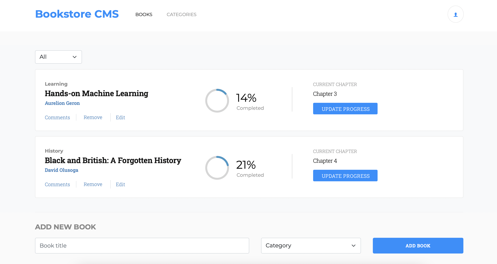
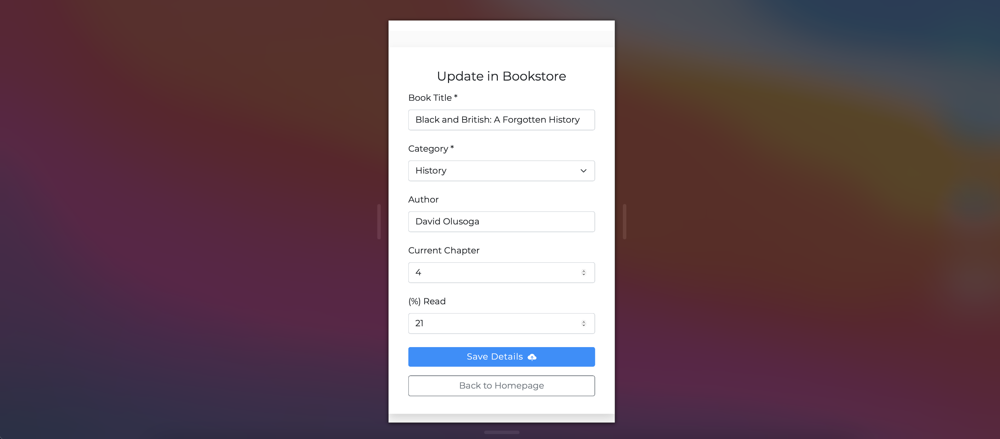

# Bookstore App

## Live Link
[Visit the Bookstore](https://redux-app-bookstore.herokuapp.com/)
## Objectives
- Using Redux in a React application
- Structuring a Redux store
- Using React Redux Hooks
- Interacting with an API Backend
- Managing async workflows with Redux Sagas
- Calculating derived data with Redux Selectors
- Unit testing a React and Redux application
- Functional Programming
- Meeting model client requirements

## Features
Bookstore CMS is a book management app that implements a model design spec. Each book has a title and belongs to some category. Users can add a book to the store by filling in the title and selecting a category in the form. To delete a book from _Bookstore CMS_ simply click on `Remove`. Above the books, the category filter displays books for a given category and by default is `All`. Toggling the dropdown filters book by selected category. To add author and reading progress to a book in the list, click on `Edit` or `Update Progress`. Adding comments, managing categories and user authentication will be available in subsequent implementations. This app is hosted on Heroku.

_Selecting a category to filter books in the store._

_Editing a book in the store_

## Prerequisites
- Internet Connection
- An Integrated Development Environment
- Chrome, Firefox or Safari across all screen sizes
- Node Package Manager [(NPM)](https://docs.npmjs.com/about-npm)

## Tools/Built With
- Node.js
- React-Create-App
- React
- React Router v6
- Redux
- Redux Saga
- Javascript ES6+
- npm packages
- Bootstrap 5
- SCSS
- HTML5/CSS

## Getting Started
- To get started with the app, clone this project by running `git clone https://github.com/george-swift/bookstore.git`
- `cd` into the directory and run `npm install` to install the needed packages and dependencies
- Run `npm start` to fire up a local server with live reloading.
- If not already redirected, visit `http://localhost:3000/` in your browser to use the bookstore.
- To terminate the server, enter `Ctrl + C` in your terminal

## Testing
A comprehensive test suite was used in the development of the Bookstore App. Run `npm test` to get a verbose test report.
## Authors

👤 &nbsp; **Ubong George**
- LinkedIn: [Ubong George](https://www.linkedin.com/in/ubong-itok)
- Twitter: [@\_\_pragmaticdev](https://twitter.com/__pragmaticdev)
- GitHub: [@george-swift](https://github.com/george-swift)

## Acknowledgments

- [React](https://reactjs.org/)
- [Redux](https://redux.js.org/api/api-reference)
- [Microverse](https://www.microverse.org/)

## Show your support

Leave a :star:️ &nbsp; if you like this project!

## License

Available as open source under the terms of the [MIT License](https://opensource.org/licenses/MIT).
